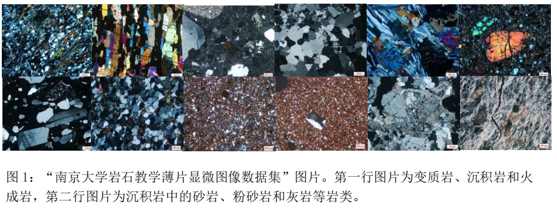

# BDC(2024-4) A题：岩石的自动鉴定

该项目针对“未来杯”2024年第四届高校大数据挑战赛A题，提供了基于机器学习的岩石的自动鉴定模型方案与解题代码：

1. 项目简述与分析
2. 机器学习算法设计与模型实现
3. 文章内容

相关代码基于 Python 实现，文章基于 LaTeX 编写。

## 题目要求

在地质学和矿物学领域，岩矿石薄片广泛应用于岩石分类、岩石演化、岩石地球化学以及矿物学等领域，对于矿产勘探和开发具有重要意义。
通过镜下岩矿石薄片，可以识别矿石中所含金属矿物，进而深入了解矿石的特征。

图 1 展示了不同种类岩石的显微镜下图片。然而，岩矿石薄片的准确识别和分类一直是具有挑战性的任务。
人工鉴定工作通过偏光显微镜进行，存在主观性强、成本高以及效率低下等问题。请你查阅相关文献，回答以下问题。

> [!NOTE]
> 说明：
> 1. 项目程序建议在 python3.6 及以上环境下搭建，其他语言不做统一要求，但是需要在运行说明中写明软件名称及版本。
>    无需提交赛题自带的图像，提交的附件不得超过 20Mb。
> 2. 除了论文外，还需要提供完整程序代码、运行说明（包括依赖包及其版本）等，以压缩包的形式提交。

### 问题一

请参赛队伍使用“南京大学岩石教学薄片显微图像数据集”中的 “南京大学沉积岩教学薄片照片数据集”，
结合颜色、纹理、亮度等多种特征，设计一个沉积岩薄片识别模型，
实现对该数据集中火山碎屑岩、砂岩、泥页岩、粉砂岩、灰岩、白云岩、硅质岩、蒸发岩和其他岩石的识别功能。

### 问题二

“南京大学岩石教学薄片显微图像数据集”包含了**变质岩**、**沉积岩**和**火成岩**三个子数据集。
请验证问题一中所建立的模型是否能够有效识别这三种不同类别的岩石。

近年来，深度学习方法在数字图像处理领域展现出显著优势，能够有效提取图像中的丰富特征，在岩石识别应用方面也取得较大进展。
是否能将颜色、纹理等特征与深度学习特征进行有效的结合，进一步提升分类模型的准确率呢？
请在问题一的研究基础上，对模型进行改进，重新对变质岩、沉积岩和火成岩这三种岩石进行分类识别。

### 问题三

[“附件 1”(测试集)](test/)由某地区的岩石薄片显微镜图像数据组成。请将问题一和问题二中的模型及其改进模型（如有）分别对“附件 1”中的岩石图像进行测试。

首先筛选出所有的“沉积岩”图片，再对“沉积岩”进行进一步分类，已知该数据集中沉积岩的种类有砂岩、泥页岩、粉砂岩、灰岩、白云岩。

最后在报告正文中给出识别每种类型岩石图片数量，并将检测结果汇总填写到“赛题提交结果.xlsx”表格中。

> [!NOTE]
> 最终提交附件时，将文件命名为“队号.xlsx”（例如：队号为bdc240001，最中提交结果的表格命名为“bdc240001.xlsx”）

## 开源协议

该项目基于 [GNU General Public License v3.0](https://www.gnu.org/licenses/gpl-3.0.en.html) 开源协议发布。

## 致谢

万分感谢我们的导师（韩老师）优良指导和鼎力支持。

万分感谢队员们 (@CarmJos, @WangGold3, @hanghangz628) 的辛勤劳作与不懈努力。

非常感谢 Jetbrains 慷慨地为我们提供开源或教育许可，让我们能够从事该项目和其他开源项目。

